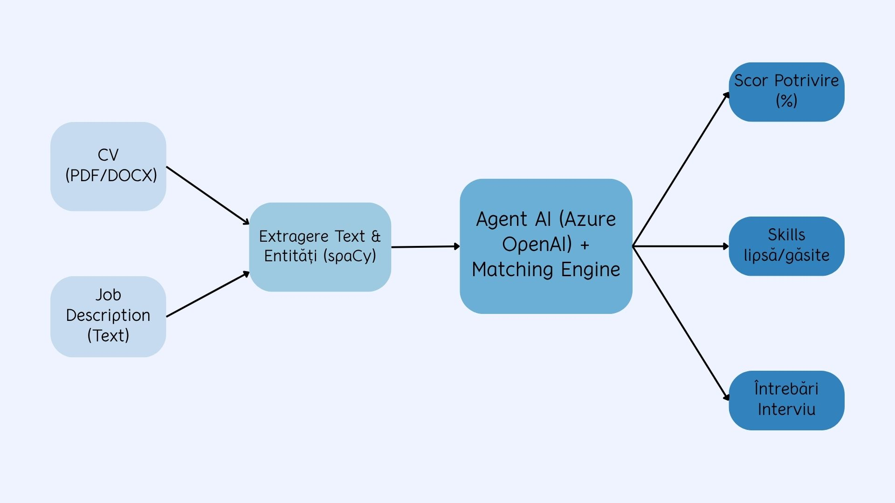

"# ai_project_2026"
"# projects_guys"

## 1. Definirea Problemei și Soluția Propusă

### Problema Curentă

În procesele moderne de recrutare, departamentele de HR sunt adesea copleșite de volumul uriaș de CV-uri primite pentru fiecare post. Această evaluare manuală aduce trei provocări majore:

- **Este lentă:** Generează cicluri de angajare prelungite și blochează resursele umane.
- **Este subiectivă:** Procesul este predispus la prejudecăți inconștiente.
- **Este inconsistentă:** Volumul mare duce la omiterea candidaților calificați și oboseală decizională.

### Soluția Noastră: AI HR Assistant

Dezvoltăm un instrument de triere a CV-urilor bazat pe AI care standardizează evaluarea candidaților. **Scopul nu este automatizarea deciziei de angajare**, ci oferirea unui suport decizional rapid și explicabil.

### Fluxul de Date (Input/Output)

- **Input:** CV-ul candidatului (PDF/DOCX) + Descrierea postului (Job Description - text).
- **Procesare:** Sistemul extrage entitățile, calculează similaritatea și analizează potrivirea prin intermediul unui agent Azure OpenAI.
- **Output:**
  1. Scor procentual de potrivire.
  2. Justificare (competențe găsite vs. competențe lipsă).
  3. Recomandări pentru interviu (întrebări personalizate).

### Schema Soluției

[Vezi aici slide-ul pentru prezentarea problemei](docs/Slide_prezentare.pdf)

## Etapa 1: Date & NLP (Setup & Rulare)

Acest modul se ocupă de parsarea CV-urilor, extragerea entităților (NER) și generarea de embeddings.

### Cerințe Importante

Pentru a evita crash-urile de memorie la nivelul sistemului de operare (Segmentation Fault) cauzate de bibliotecile AI (`spaCy`, `sentence-transformers`), **este obligatoriu să folosiți Python 3.12** (versiunile beta ca 3.14 sau mai vechi pot avea probleme cu fișierele precompilate C++ pe Windows).

### 1. Instalare Biblioteci

Asigurați-vă că instalați pachetele specific pentru Python 3.12:
`py -3.12 -m pip install PyPDF2 python-docx spacy sentence-transformers numpy`

### 2. Descărcare Model de Limbă (spaCy)

Descărcați dicționarul pentru limba engleză:
`py -3.12 -m spacy download en_core_web_sm`

### 3. Testare

Pentru a rula un test cap-coadă pe un CV de exemplu:
`py -3.12 example_run.py`
_(Se va descărca automat modelul all-MiniLM-L6-v2 la prima rulare)._
